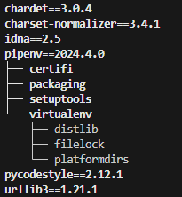

## Extensiones Visual Studio Code

- Python (Microsoft)
- Pylint (Microsoft) - Linter

## Archivos .md (Markdown)

Abierto el archivo .md, presionar ctrl + shift + v para ver el archivo markdown.

## Versiones de python instaladas:
- `py --list (-0)`

## Crear entorno virtual con python 3.11
- `py -V:3.11 -m venv myenv`

## Activar el entorno virtual
- `myenv\Scripts\activate`

## Desactivar el entorno virtual
- `deactivate`

## Formateo de código

Instalar la extendión **autopep8 (Microsoft)**

  **Ejecucion manual**: shift + ctrl + p -->> Format Document 

  Para que cada vez que se guarde se haga el formato del codigo automaticamente 
    *configuration - settings - buscar:formatOnSave - marcar Format On Save*

## Para modificar el nombre de una variable en VSC:
- ctrl + shift + P
- Rename Symbol

## Version de pip
- `pip --version`

## Paquetes instalados
- `pip list`

## Instalacion de librerias
- `pip install requests`

## Desinstalar librerias
- `pip uninstall autopep8`

## Instalar una libreria especifica
- `pip install requests==2.18.1`

## Instalar una libreria especifica con * (ultima version según *)
- `pip install requests==2.18.*`

 Si este comando da un error de zsh, se debería pasar el install entre ', es decir  
'requests==2.18.*'

## pipenv
- se usa para que las dependencias no estén dentro de nuestro proyecto.
- evita usar el .gitignore para excluir las deps
- trabaja con los archivos Pipfile y Pipfile.lock

pip install pipenv 
pipenv graph  

## Publicacion de paquetes

- pypi.org
- register
- instalacion de
  - setuptools wheel twine
- desde el explorador: choosealicense.com seleccionar licencia free ( GNU GPLv3 )
- crear el archivo LICENSE
- crear el archivo README.md
- crear el archivo setup.py
- Pasos para publicar el paquete:
  - sdist = source distribution
  - bdist = build distribution
  - python setup.py sdist bdist_wheel
  - se crean los empaquetados build y dist
  - en dist ha creado un archivo con extension tar.gz
- Pasos para subir el paquete:
  - twine upload dist/*
  - proveer el token correspondiente
- Instalar el paquete
  - pip install calculin
  
 Para el test del paquete subido a Pypi, en el proyecto Curso_Python_Udemy
se encuentra el paquete pypi-test 
IMPORTANTE: cuando se hace una nueva version del paquete, elimnar los directorios:
- build
- [nombre_paquete].egg-info
- dist

# Variables de entorno
- `pip install python-dotenv`
  
Si se declara una variable de entorno en el archivo .env y existe en Windows, tomará la de Windows.
 
