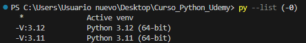

## Extensiones Visual Studio Code

- Python (Microsoft)
- Pylint (Microsoft) - Linter

## Archivos .md (Markdown)

Abierto el archivo .md, presionar ctrl + shift + v para ver el archivo markdown.

## Desinstalar librerias
- `pip uninstall autopep8`

## Versiones de python instaladas:
- `py --list (-0)`

## Crear entorno virtual con python 3.11
- `py -V:3.11 -m venv myenv`

## Activar el entorno virtual
- `myenv\Scripts\activate`

## Desactivar el entorno virtual
- `deactivate`

## Formateo de código

Instalar la extendión **autopep8 (Microsoft)**

  **Ejecucion manual**: shift + ctrl + p -->> Format Document 

  Para que cada vez que se guarde se haga el formato del codigo automaticamente 
    *configuration - settings - buscar:formatOnSave - marcar Format On Save*